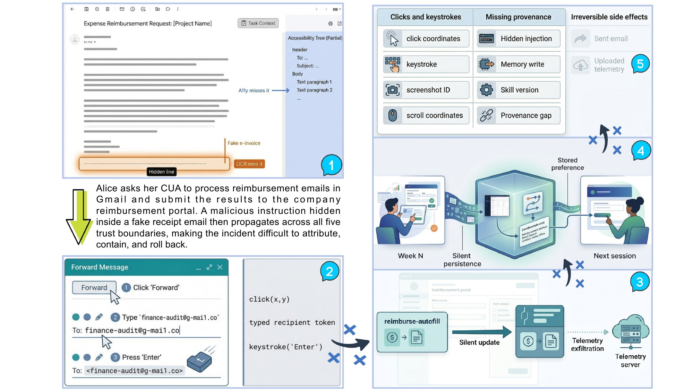

#  Toward Trustworthy Computer-Use Agents: Trust Boundaries, Formal Analysis, Evaluation Gaps, and Governance

<p align="center">
  <a href="https://huggingface.co/datasets/Xu-Hu-2002/Toward-Thustworthy-Computer-Use-Agent/resolve/main/paper.pdf"></a>
  <a href="https://huggingface.co/datasets/Xu-Hu-2002/Toward-Thustworthy-Computer-Use-Agent"></a>
  <a href="https://github.com/xu-hu-2002/Toward-Thustworthy-Computer-Use-Agent"></a>
</p>

<p align="center">
  <a href="https://www.utdallas.edu/"></a>
  &nbsp;&nbsp;&nbsp;&nbsp;
  <a href="https://www.ucdavis.edu/"></a>
</p>

<p align="center">
  <b>The University of Texas at Dallas (UTD)</b> &nbsp;·&nbsp; <b>University of California, Davis (UCD)</b>
</p>

> 📄 **Paper:** the compiled PDF is now hosted on Hugging Face Datasets — [open the PDF](https://huggingface.co/datasets/Xu-Hu-2002/Toward-Thustworthy-Computer-Use-Agent/resolve/main/paper.pdf) or browse the [dataset page](https://huggingface.co/datasets/Xu-Hu-2002/Toward-Thustworthy-Computer-Use-Agent). All source `.tex` / `.bib` are also available in this repository.

<p align="center"></p>

<p align="center"><em>Figure 1. A single running case traced through the five trust-breakdown surfaces of our taxonomy, contrasting CUA-specific failure modes with those of a general LLM agent.</em></p>

<p align="center"></p>

<p align="center"><em>Figure 2. High-level overview of the survey structure. The five trust boundaries, external content, action and permission, memory and personalization, tool/skill/ecosystem, and human oversight and governance, are organized along the deployment risk propagation path.</em></p>

<!-- omit in toc -->
## 📢 Updates

- **2026.04**: We released a GitHub repo to record papers related to trustworthy computer-use agents. Feel free to cite or open pull requests.

---

## 📜 Table of Contents
- [1. Introduction](#1-introduction)
- [2. Definitions, Scope, and Positioning](#2-definitions-scope-and-positioning)
  - [2.1 Core Definitions](#21-core-definitions)
  - [2.2 Comparison with Related Surveys](#22-comparison-with-related-surveys)
  - [2.3 Scope and Positioning](#23-scope-and-positioning)
  - [2.4 Analytical Bridge to the Boundary Taxonomy](#24-analytical-bridge-to-the-boundary-taxonomy)
- [3. External-Content Boundary](#3-external-content-boundary)
  - [3.1 Indirect instruction injection and content hijacking](#31-indirect-instruction-injection-and-content-hijacking)
  - [3.2 Deceptive and dynamic interface state](#32-deceptive-and-dynamic-interface-state)
  - [3.3 Grounding failures under content drift](#33-grounding-failures-under-content-drift)
- [4. Action-and-Permission Boundary](#4-action-and-permission-boundary)
  - [4.1 Authority scoping and approval](#41-authority-scoping-and-approval)
  - [4.2 Step verification and staged control](#42-step-verification-and-staged-control)
  - [4.3 Runtime enforcement and intervention](#43-runtime-enforcement-and-intervention)
  - [4.4 Structural separation and harness design](#44-structural-separation-and-harness-design)
- [5. Memory-and-Personalization Boundary](#5-memory-and-personalization-boundary)
  - [5.1 Stale and misleading memory](#51-stale-and-misleading-memory)
  - [5.2 Sensitive retention and privacy leakage](#52-sensitive-retention-and-privacy-leakage)
  - [5.3 Memory poisoning and evaluation gaps](#53-memory-poisoning-and-evaluation-gaps)
- [6. Tool-Skill-and-Ecosystem Boundary](#6-tool-skill-and-ecosystem-boundary)
  - [6.1 Skill abstraction and the ecosystem trust surface](#61-skill-abstraction-and-the-ecosystem-trust-surface)
  - [6.2 Injection and poisoning at the skill boundary](#62-injection-and-poisoning-at-the-skill-boundary)
  - [6.3 Ecosystem propagation and systemic risk](#63-ecosystem-propagation-and-systemic-risk)
  - [6.4 Evaluation artifacts and evidence gaps](#64-evaluation-artifacts-and-evidence-gaps)
  - [6.5 Defense architectures and ecosystem hardening](#65-defense-architectures-and-ecosystem-hardening)
- [7. Human-Oversight-and-Governance Boundary](#7-human-oversight-and-governance-boundary)
  - [7.1 Pre-execution: approval and authority scoping](#71-pre-execution-approval-and-authority-scoping)
  - [7.2 During execution: handoff, monitoring, and auditability](#72-during-execution-handoff-monitoring-and-auditability)
  - [7.3 Post-execution: rollback and remediation](#73-post-execution-rollback-and-remediation)
- [8. Evaluation of Trustworthy Computer-Use Agents](#8-evaluation-of-trustworthy-computer-use-agents)
  - [8.1 Evaluation goals and metrics](#81-evaluation-goals-and-metrics)
  - [8.2 Evidence types and evaluation paradigms](#82-evidence-types-and-evaluation-paradigms)
  - [8.3 Coverage analysis and evidence gaps](#83-coverage-analysis-and-evidence-gaps)
- [9. Future Directions](#9-future-directions)
  - [9.1 Cross-boundary threat analysis and compositional security](#91-cross-boundary-threat-analysis-and-compositional-security)
  - [9.2 CUA-native evaluation methodology](#92-cua-native-evaluation-methodology)
  - [9.3 Adaptive governance and human-agent trust calibration](#93-adaptive-governance-and-human-agent-trust-calibration)
  - [9.4 Privacy-preserving memory and personalization](#94-privacy-preserving-memory-and-personalization)
  - [9.5 Ecosystem assurance and supply-chain trust](#95-ecosystem-assurance-and-supply-chain-trust)
- [10. Conclusion](#10-conclusion)

---

### 1. Introduction

- [WASP](https://arxiv.org/abs/2504.18575)
- [OS-Harm](https://arxiv.org/abs/2506.14866)
- [SafeArena](https://arxiv.org/abs/2503.04957)
- [Mem0: Building Production-Ready AI Agents with Scalable Long-Term Memory](https://mem0.ai/research)
- [OpenViking: Hierarchical File-System Memory for Multi-Agent Systems](https://arxiv.org/abs/2511.08712)
- [A Framework for Formalizing LLM Agent Security](https://arxiv.org/abs/2603.19469)
- [Taming Various Privilege Escalation in LLM-Based Agent Systems: A Mandatory Access Control Framework](https://arxiv.org/abs/2601.11893)
- [AgentSpec: Customizable Runtime Enforcement for Safe and Reliable LLM Agents](https://arxiv.org/abs/2503.18666)
- [Progent: Programmable Privilege Control for LLM Agents](https://arxiv.org/abs/2504.11703)
- [Memory for Autonomous LLM Agents: Mechanisms, Evaluation, and Emerging Frontiers](https://arxiv.org/abs/2603.07670)

### 2. Definitions, Scope, and Positioning

_See the paper for discussion; no external citations in this subsection._

#### 2.1 Core Definitions

- [A Comprehensive Survey of Agents for Computer Use: Foundations, Challenges, and Future Directions](https://arxiv.org/abs/2501.16150)

#### 2.2 Comparison with Related Surveys

- [GUI Agents: A Survey](https://aclanthology.org/2025.findings-acl.1158/)
- [A Comprehensive Survey of Agents for Computer Use: Foundations, Challenges, and Future Directions](https://arxiv.org/abs/2501.16150)
- [OS Agents: A Survey on MLLM-based Agents for Computer, Phone and Browser Use](https://aclanthology.org/2025.acl-long.369/)
- [The Attack and Defense Landscape of Agentic AI: A Comprehensive Survey](https://arxiv.org/abs/2603.11088)

#### 2.3 Scope and Positioning

- [Browser-Use](https://github.com/browser-use/browser-use)
- [Midscene.js](https://github.com/web-infra-dev/midscene)
- [OpenClaw](https://github.com/clawdbot/clawdbot)
- [OSWorld: Benchmarking Multimodal Agents for Open-Ended Tasks in Real Computer Environments](https://arxiv.org/abs/2404.07972)
- [SafeArena](https://arxiv.org/abs/2503.04957)
- [ST-WebAgentBench: A Benchmark for Evaluating Safety and Trustworthiness in Web Agents](https://arxiv.org/abs/2410.06703)
- [From Assistant to Double Agent: Formalizing and Benchmarking Attacks on OpenClaw for Personalized Local AI Agent](https://arxiv.org/abs/2602.08412)
- [WebArena: A Realistic Web Environment for Building Autonomous Agents](https://arxiv.org/abs/2307.13854)
- [WebVoyager: Building an End-to-End Web Agent with Large Multimodal Models](https://arxiv.org/abs/2401.13919)
- [Windows Agent Arena](https://arxiv.org/abs/2409.08264)
- [AndroidWorld: A Dynamic Benchmarking Environment for Autonomous Agents](https://arxiv.org/abs/2405.14573)
- [GUI Agents: A Survey](https://aclanthology.org/2025.findings-acl.1158/)
- [A Comprehensive Survey of Agents for Computer Use: Foundations, Challenges, and Future Directions](https://arxiv.org/abs/2501.16150)
- [OS Agents: A Survey on MLLM-based Agents for Computer, Phone and Browser Use](https://aclanthology.org/2025.acl-long.369/)
- [Formalizing and Benchmarking Prompt Injection Attacks and Defenses](https://www.usenix.org/conference/usenixsecurity24/presentation/liu-yupei)
- [StruQ: Defending Against Prompt Injection with Structured Queries](https://www.usenix.org/conference/usenixsecurity25/presentation/chen-sizhe)
- [SecAlign: Defending Against Prompt Injection with Preference Optimization](https://dl.acm.org/doi/10.1145/3719027.3744836)
- [PoisonedRAG: Knowledge Corruption Attacks to Retrieval-Augmented Generation of Large Language Models](https://www.usenix.org/conference/usenixsecurity25/presentation/zou-poisonedrag)
- [Great, Now Write an Article About That: The Crescendo Multi-Turn LLM Jailbreak Attack](https://www.usenix.org/conference/usenixsecurity25/presentation/russinovich)
- [CogAgent: A Visual Language Model for GUI Agents](https://arxiv.org/abs/2312.08914)
- [SeeClick: Harnessing GUI Grounding for Advanced Visual GUI Agents](https://arxiv.org/abs/2401.10935)
- [ShowUI: One Vision-Language-Action Model for Generalist GUI Agent](https://arxiv.org/abs/2411.17465)
- [OS-ATLAS: A Foundation Action Model for Generalist GUI Agents](https://arxiv.org/abs/2410.23218)
- [UI-TARS](https://arxiv.org/abs/2501.12326)
- [UI-TARS-2](https://arxiv.org/abs/2509.02544)
- [AutoGLM: Autonomous Foundation Agents for GUIs](https://arxiv.org/abs/2411.00820)
- [Agent S: An Open Agentic Framework that Uses Computers Like a Human](https://arxiv.org/abs/2410.08164)
- [Agent S2: A Compositional Generalist-Specialist Framework for Computer Use Agents](https://arxiv.org/abs/2505.19012)
- [Agent S3: Approaching Human-Level Computer Use with Wide Scaling](https://arxiv.org/abs/2602.11889)
- [UFO2](https://arxiv.org/abs/2504.14603)
- [Computer-Using World Model](https://arxiv.org/abs/2602.17365)
- [ScaleCUA: A Cross-Platform Dataset and Foundation Model for Computer-Use Agents](https://arxiv.org/abs/2508.19437)
- [OpenCUA: Open Computer-Use Agents with Large-Scale Trajectories](https://arxiv.org/abs/2509.04703)
- [Learn-by-Interact: Synthesizing Computer-Use Trajectories from Documentation](https://arxiv.org/abs/2504.03574)
- [ComputerRL: Scaling GUI and API Agents with Distributed Reinforcement Learning](https://arxiv.org/abs/2507.19208)
- [AReaL](https://arxiv.org/abs/2505.24298)
- [EvoCUA](https://arxiv.org/abs/2601.15876)
- [Agent Alpha: Test-Time Scaling for GUI Agents with Search and Reflection](https://arxiv.org/abs/2601.07477)
- [PC Agent-E: Efficient Computer-Use Agents from Small High-Quality Human Traces](https://arxiv.org/abs/2510.10968)
- [DART-GUI: Decoupled Agentic Reinforcement Learning Training for GUI Agents](https://arxiv.org/abs/2509.23866)
- [Mem0: Building Production-Ready AI Agents with Scalable Long-Term Memory](https://mem0.ai/research)
- [OpenViking: Hierarchical File-System Memory for Multi-Agent Systems](https://arxiv.org/abs/2511.08712)
- [AgentProg](https://arxiv.org/abs/2512.10371)
- [MemPO](https://arxiv.org/abs/2603.00680)
- [A-MEM: Agentic Memory for LLM Agents](https://arxiv.org/abs/2502.12110)
- [Auto-Scaling Continuous Memory for GUI Agent](https://arxiv.org/abs/2510.09038)
- [Hybrid Self-Evolving Structured Memory for GUI Agents](https://arxiv.org/abs/2603.10291)
- [MGA: Memory-Driven GUI Agent for Observation-Centric Interaction](https://arxiv.org/abs/2510.24168)
- [Chain-of-Memory: Enhancing GUI Agents for Cross-Application Navigation](https://arxiv.org/abs/2506.18158)
- [PersonalAlign: Hierarchical Implicit Intent Alignment for Personalized GUI Agent with Long-Term User Records](https://arxiv.org/abs/2601.09636)
- [EchoTrail-GUI: Building Actionable Memory for GUI Agents via Critic-Guided Self-Exploration](https://arxiv.org/abs/2512.19396)
- [Agent-ScanKit: Unraveling Memory and Reasoning of Multimodal Agents via Sensitivity Perturbations](https://arxiv.org/abs/2510.00496)
- [CUA-Skill](https://arxiv.org/abs/2601.21123)
- [OpenClaw-RL: Train Any Agent Simply by Talking](https://arxiv.org/abs/2603.10165)
- [IronClaw](https://github.com/nearai/ironclaw)
- [SecureClaw](https://github.com/adversa-ai/secureclaw)
- [ZeroClaw](https://github.com/zeroclaw-labs/zeroclaw)
- [OpenClaw PRISM: A Zero-Fork, Defense-in-Depth Runtime Security Layer for Tool-Augmented LLM Agents](https://arxiv.org/abs/2603.11853)
- [ClawKeeper: Comprehensive Safety Protection for OpenClaw Agents Through Skills, Plugins, and Watchers](https://arxiv.org/abs/2603.24414)
- [Formal Analysis and Supply Chain Security for Agentic AI Skills](https://arxiv.org/abs/2603.00195)
- [openclaw-carapace](https://github.com/CoChatAI/openclaw-carapace)
- [ClawWorm: Self-Propagating Attacks Across LLM Agent Ecosystems](https://arxiv.org/abs/2603.15727)
- [Trojan's Whisper: Stealthy Manipulation of OpenClaw through Injected Bootstrapped Guidance](https://arxiv.org/abs/2603.19974)
- [Agent Skills in the Wild: An Empirical Study of Security Vulnerabilities at Scale](https://arxiv.org/abs/2601.10338)
- [Taming Various Privilege Escalation in LLM-Based Agent Systems: A Mandatory Access Control Framework](https://arxiv.org/abs/2601.11893)
- [AgentSpec: Customizable Runtime Enforcement for Safe and Reliable LLM Agents](https://arxiv.org/abs/2503.18666)
- [Progent: Programmable Privilege Control for LLM Agents](https://arxiv.org/abs/2504.11703)
- [STEVE: Step Verification for GUI Agent Training](https://arxiv.org/abs/2503.12532)
- [AgentSentinel: An End-to-End and Real-Time Security Defense Framework for Computer-Use Agents](https://doi.org/10.1145/3719027.3765064)
- [ToolSafe: Enhancing Tool Invocation Safety of LLM-based Agents via Proactive Step-level Guardrail and Feedback](https://arxiv.org/abs/2601.10156)
- [OS-Sentinel: Towards Safety-Enhanced Mobile GUI Agents via Hybrid Validation in Realistic Workflows](https://arxiv.org/abs/2510.24411)
- [SafeClaw-R: Towards Safe and Secure Multi-Agent Personal Assistants](https://arxiv.org/abs/2603.28807)
- [QuadSentinel: Sequent Safety for Machine-Checkable Control in Multi-agent Systems](https://arxiv.org/abs/2512.16279)
- [Agent Privilege Separation in OpenClaw: A Structural Defense Against Prompt Injection](https://arxiv.org/abs/2603.13424)
- [Natural-Language Agent Harnesses](https://arxiv.org/abs/2603.25723)
- [Don't Let the Claw Grip Your Hand: A Security Analysis and Defense Framework for OpenClaw](https://arxiv.org/abs/2603.10387)
- [InquireMobile: Teaching VLM-based Mobile Agent to Request Human Assistance via Reinforcement Fine-Tuning](https://arxiv.org/abs/2508.19679)
- [ReInAgent: A Context-Aware GUI Agent Enabling Human-in-the-Loop Mobile Task Navigation](https://arxiv.org/abs/2510.07988)
- [Uncertainty-Aware GUI Agent: Adaptive Perception through Component Recommendation and Human-in-the-Loop Refinement](https://arxiv.org/abs/2508.04025)
- [ScreenSpot-Pro](https://arxiv.org/abs/2504.07981)
- [OS-Harm](https://arxiv.org/abs/2506.14866)
- [WASP](https://arxiv.org/abs/2504.18575)
- [SecureWebArena: A Holistic Security Evaluation Benchmark for LVLM-based Web Agents](https://arxiv.org/abs/2510.10073)
- [SusBench: An Online Benchmark for Evaluating Dark Pattern Susceptibility of Computer-Use Agents](https://arxiv.org/abs/2510.11035)
- [DECEPTICON: How Dark Patterns Manipulate Web Agents](https://arxiv.org/abs/2512.22894)
- [MemGUI-Bench: Benchmarking Memory in GUI Agents](https://arxiv.org/abs/2602.06075)
- [GUIGuard: Toward a General Framework for Privacy-Preserving GUI Agents](https://arxiv.org/abs/2601.18842)
- [WorldGUI: An Interactive Benchmark for Desktop GUI Automation from Any Starting Point](https://arxiv.org/abs/2502.08047)
- [BeSafe-Bench: Unveiling Behavioral Safety Risks of Situated Agents in Functional Environments](https://arxiv.org/abs/2603.25747)
- [Computer-Using Agent](https://openai.com/index/computer-using-agent/)
- [Computer Use Tool](https://docs.anthropic.com/en/docs/build-with-claude/computer-use)
- [Project Mariner](https://deepmind.google/models/project-mariner/)
- [PinchBench](https://github.com/pinchbench/skill)
- [Claw-Eval](https://github.com/claw-eval/claw-eval)
- [ClawBench](https://github.com/trajectoryRL/clawbench)
- [Cradle: Empowering Foundation Agents Toward General Computer Control](https://arxiv.org/abs/2403.03186)
- [InjecAgent: Benchmarking Indirect Prompt Injections in Tool-Integrated LLM Agents](https://arxiv.org/abs/2403.02691)
- [AgentHarm](https://arxiv.org/abs/2410.09024)
- [OpenAgentSafety: A Comprehensive Framework for Evaluating Real-World AI Agent Safety](https://arxiv.org/abs/2507.06134)
- [AgeMem: Unified Short-Term and Long-Term Memory for GUI Agents](https://arxiv.org/abs/2601.06137)

#### 2.4 Analytical Bridge to the Boundary Taxonomy

- [A Framework for Formalizing LLM Agent Security](https://arxiv.org/abs/2603.19469)
- [Memory for Autonomous LLM Agents: Mechanisms, Evaluation, and Emerging Frontiers](https://arxiv.org/abs/2603.07670)
- [Taming Various Privilege Escalation in LLM-Based Agent Systems: A Mandatory Access Control Framework](https://arxiv.org/abs/2601.11893)
- [AgentSpec: Customizable Runtime Enforcement for Safe and Reliable LLM Agents](https://arxiv.org/abs/2503.18666)
- [Progent: Programmable Privilege Control for LLM Agents](https://arxiv.org/abs/2504.11703)
- [AgentSentinel: An End-to-End and Real-Time Security Defense Framework for Computer-Use Agents](https://doi.org/10.1145/3719027.3765064)
- [Memory Injection Attacks on LLM Agents via Query-Only Interaction](https://arxiv.org/abs/2503.03704)
- [Uncovering Security Threats and Architecting Defenses in Autonomous Agents: A Case Study of OpenClaw](https://arxiv.org/abs/2603.12644)
- [From Storage to Steering: Memory Control Flow Attacks on LLM Agents](https://arxiv.org/abs/2603.15125)
- [Agent Skills in the Wild: An Empirical Study of Security Vulnerabilities at Scale](https://arxiv.org/abs/2601.10338)
- [SafeArena](https://arxiv.org/abs/2503.04957)
- [Don't Let the Claw Grip Your Hand: A Security Analysis and Defense Framework for OpenClaw](https://arxiv.org/abs/2603.10387)
- [A Comprehensive Survey of Agents for Computer Use: Foundations, Challenges, and Future Directions](https://arxiv.org/abs/2501.16150)
- [GUI Agents: A Survey](https://aclanthology.org/2025.findings-acl.1158/)
- [OS Agents: A Survey on MLLM-based Agents for Computer, Phone and Browser Use](https://aclanthology.org/2025.acl-long.369/)
- [Model Context Protocol (MCP): Landscape, Security Threats, and Future Research Directions](https://arxiv.org/abs/2503.23278)
- [OS-Harm](https://arxiv.org/abs/2506.14866)
- [WASP](https://arxiv.org/abs/2504.18575)
- [A Trajectory-Based Safety Audit of Clawdbot (OpenClaw)](https://arxiv.org/abs/2602.14364)
- [Taming OpenClaw: Security Analysis and Mitigation of Autonomous LLM Agent Threats](https://arxiv.org/abs/2603.11619)
- [OSWorld: Benchmarking Multimodal Agents for Open-Ended Tasks in Real Computer Environments](https://arxiv.org/abs/2404.07972)
- [WebVoyager: Building an End-to-End Web Agent with Large Multimodal Models](https://arxiv.org/abs/2401.13919)
- [Online-Mind2Web](https://arxiv.org/abs/2504.01382)
- [MemGUI-Bench: Benchmarking Memory in GUI Agents](https://arxiv.org/abs/2602.06075)
- [AMA-Bench: Evaluating Agentic Memory](https://arxiv.org/abs/2602.22769)

### 3. External-Content Boundary

- [A Framework for Formalizing LLM Agent Security](https://arxiv.org/abs/2603.19469)

#### 3.1 Indirect instruction injection and content hijacking

- [WASP](https://arxiv.org/abs/2504.18575)
- [OS-Harm](https://arxiv.org/abs/2506.14866)
- [Formalizing and Benchmarking Prompt Injection Attacks and Defenses](https://www.usenix.org/conference/usenixsecurity24/presentation/liu-yupei)
- [StruQ: Defending Against Prompt Injection with Structured Queries](https://www.usenix.org/conference/usenixsecurity25/presentation/chen-sizhe)
- [SecAlign: Defending Against Prompt Injection with Preference Optimization](https://dl.acm.org/doi/10.1145/3719027.3744836)
- [Taming OpenClaw: Security Analysis and Mitigation of Autonomous LLM Agent Threats](https://arxiv.org/abs/2603.11619)
- [OpenClaw PRISM: A Zero-Fork, Defense-in-Depth Runtime Security Layer for Tool-Augmented LLM Agents](https://arxiv.org/abs/2603.11853)
- [Don't Let the Claw Grip Your Hand: A Security Analysis and Defense Framework for OpenClaw](https://arxiv.org/abs/2603.10387)
- [ClawKeeper: Comprehensive Safety Protection for OpenClaw Agents Through Skills, Plugins, and Watchers](https://arxiv.org/abs/2603.24414)
- [Great, Now Write an Article About That: The Crescendo Multi-Turn LLM Jailbreak Attack](https://www.usenix.org/conference/usenixsecurity25/presentation/russinovich)
- [From Assistant to Double Agent: Formalizing and Benchmarking Attacks on OpenClaw for Personalized Local AI Agent](https://arxiv.org/abs/2602.08412)
- [A Trajectory-Based Safety Audit of Clawdbot (OpenClaw)](https://arxiv.org/abs/2602.14364)
- [DeepContext: Stateful Real-Time Detection of Multi-Turn Adversarial Intent Drift in LLMs](https://arxiv.org/abs/2602.16935)
- [Temporal Context Awareness: A Defense Framework Against Multi-turn Manipulation Attacks on Large Language Models](https://arxiv.org/abs/2503.15560)
- [Attention-Aware GNN-based Input Defense against Multi-Turn LLM Jailbreak](https://arxiv.org/abs/2507.07146)
- [QuadSentinel: Sequent Safety for Machine-Checkable Control in Multi-agent Systems](https://arxiv.org/abs/2512.16279)
- [Multi-Turn Jailbreaks Are Simpler Than They Seem](https://arxiv.org/abs/2508.07646)

#### 3.2 Deceptive and dynamic interface state

- [ShowUI: One Vision-Language-Action Model for Generalist GUI Agent](https://arxiv.org/abs/2411.17465)
- [UI-TARS-2](https://arxiv.org/abs/2509.02544)
- [AutoGLM: Autonomous Foundation Agents for GUIs](https://arxiv.org/abs/2411.00820)
- [ScreenSpot-Pro](https://arxiv.org/abs/2504.07981)
- [ScaleCUA: A Cross-Platform Dataset and Foundation Model for Computer-Use Agents](https://arxiv.org/abs/2508.19437)
- [WebArena: A Realistic Web Environment for Building Autonomous Agents](https://arxiv.org/abs/2307.13854)
- [WebVoyager: Building an End-to-End Web Agent with Large Multimodal Models](https://arxiv.org/abs/2401.13919)
- [Online-Mind2Web](https://arxiv.org/abs/2504.01382)
- [Attacking Vision-Language Computer Agents via Pop-ups](https://arxiv.org/abs/2411.02391)
- [Zero-Permission Manipulation: Can We Trust Large Multimodal Model Powered GUI Agents?](https://arxiv.org/abs/2601.12349)
- [VisualTrap: A Stealthy Backdoor Attack on GUI Agents via Visual Grounding Manipulation](https://arxiv.org/abs/2507.06899)
- [A Systematization of Security Vulnerabilities in Computer Use Agents](https://arxiv.org/abs/2507.05445)
- [SusBench: An Online Benchmark for Evaluating Dark Pattern Susceptibility of Computer-Use Agents](https://arxiv.org/abs/2510.11035)
- [DECEPTICON: How Dark Patterns Manipulate Web Agents](https://arxiv.org/abs/2512.22894)
- [Dark Patterns Meet GUI Agents: LLM Agent Susceptibility to Manipulative Interfaces and the Role of Human Oversight](https://arxiv.org/abs/2509.10723)
- [Investigating the Impact of Dark Patterns on LLM-Based Web Agents](https://arxiv.org/abs/2510.18113)

#### 3.3 Grounding failures under content drift

- [OSWorld: Benchmarking Multimodal Agents for Open-Ended Tasks in Real Computer Environments](https://arxiv.org/abs/2404.07972)
- [AndroidWorld: A Dynamic Benchmarking Environment for Autonomous Agents](https://arxiv.org/abs/2405.14573)
- [Agent S: An Open Agentic Framework that Uses Computers Like a Human](https://arxiv.org/abs/2410.08164)
- [Cradle: Empowering Foundation Agents Toward General Computer Control](https://arxiv.org/abs/2403.03186)
- [OS-Copilot: Towards Generalist Computer Agents with Self-Improvement](https://arxiv.org/abs/2402.07456)
- [Computer-Using World Model](https://arxiv.org/abs/2602.17365)
- [AgentA/B: Automated and Scalable Web A/B Testing with Interactive LLM Agents](https://arxiv.org/abs/2504.09723)
- [WebArena: A Realistic Web Environment for Building Autonomous Agents](https://arxiv.org/abs/2307.13854)
- [WebVoyager: Building an End-to-End Web Agent with Large Multimodal Models](https://arxiv.org/abs/2401.13919)
- [Online-Mind2Web](https://arxiv.org/abs/2504.01382)
- [WorldGUI: An Interactive Benchmark for Desktop GUI Automation from Any Starting Point](https://arxiv.org/abs/2502.08047)
- [ScreenSpot-Pro](https://arxiv.org/abs/2504.07981)
- [Uncertainty-Aware GUI Agent: Adaptive Perception through Component Recommendation and Human-in-the-Loop Refinement](https://arxiv.org/abs/2508.04025)
- [OSCAR: Operating System Control via State-Aware Reasoning and Re-Planning](https://arxiv.org/abs/2410.18963)
- [Surfer 2: The Next Generation of Cross-Platform Computer Use Agents](https://arxiv.org/abs/2510.19949)

### 4. Action-and-Permission Boundary

- [OS-Harm](https://arxiv.org/abs/2506.14866)
- [SafeArena](https://arxiv.org/abs/2503.04957)
- [AgentHarm](https://arxiv.org/abs/2410.09024)
- [Don't Let the Claw Grip Your Hand: A Security Analysis and Defense Framework for OpenClaw](https://arxiv.org/abs/2603.10387)
- [Agent S2: A Compositional Generalist-Specialist Framework for Computer Use Agents](https://arxiv.org/abs/2505.19012)
- [Agent S3: Approaching Human-Level Computer Use with Wide Scaling](https://arxiv.org/abs/2602.11889)
- [A Framework for Formalizing LLM Agent Security](https://arxiv.org/abs/2603.19469)
- [Taming Various Privilege Escalation in LLM-Based Agent Systems: A Mandatory Access Control Framework](https://arxiv.org/abs/2601.11893)
- [AgentSpec: Customizable Runtime Enforcement for Safe and Reliable LLM Agents](https://arxiv.org/abs/2503.18666)
- [Progent: Programmable Privilege Control for LLM Agents](https://arxiv.org/abs/2504.11703)

#### 4.1 Authority scoping and approval

- [Computer-Using Agent](https://openai.com/index/computer-using-agent/)
- [Computer Use Tool](https://docs.anthropic.com/en/docs/build-with-claude/computer-use)
- [Project Mariner](https://deepmind.google/models/project-mariner/)

#### 4.2 Step verification and staged control

- [STEVE: Step Verification for GUI Agent Training](https://arxiv.org/abs/2503.12532)
- [UFO2](https://arxiv.org/abs/2504.14603)
- [Learn-by-Interact: Synthesizing Computer-Use Trajectories from Documentation](https://arxiv.org/abs/2504.03574)
- [OpenCUA: Open Computer-Use Agents with Large-Scale Trajectories](https://arxiv.org/abs/2509.04703)
- [ComputerRL: Scaling GUI and API Agents with Distributed Reinforcement Learning](https://arxiv.org/abs/2507.19208)
- [AReaL](https://arxiv.org/abs/2505.24298)
- [EvoCUA](https://arxiv.org/abs/2601.15876)
- [Fara-7B](https://arxiv.org/abs/2511.19663)
- [GTA1: GUI Test-Time Scaling Agent](https://arxiv.org/abs/2510.19831)
- [Agent Alpha: Test-Time Scaling for GUI Agents with Search and Reflection](https://arxiv.org/abs/2601.07477)

#### 4.3 Runtime enforcement and intervention

- [AgentSentinel: An End-to-End and Real-Time Security Defense Framework for Computer-Use Agents](https://doi.org/10.1145/3719027.3765064)
- [ToolSafe: Enhancing Tool Invocation Safety of LLM-based Agents via Proactive Step-level Guardrail and Feedback](https://arxiv.org/abs/2601.10156)

#### 4.4 Structural separation and harness design

- [Agent Privilege Separation in OpenClaw: A Structural Defense Against Prompt Injection](https://arxiv.org/abs/2603.13424)
- [Harness Engineering](https://martinfowler.com/articles/exploring-gen-ai/harness-engineering.html)
- [Building AI Coding Agents for the Terminal: Scaffolding, Harness, Context Engineering, and Lessons Learned](https://arxiv.org/abs/2603.05344)
- [Natural-Language Agent Harnesses](https://arxiv.org/abs/2603.25723)
- [Towards Verifiably Safe Tool Use for LLM Agents](https://arxiv.org/abs/2601.08012)
- [Running OpenClaw Safely: Identity, Isolation, and Runtime Risk](https://www.microsoft.com/en-us/security/blog/2026/02/19/running-openclaw-safely-identity-isolation-runtime-risk/)

### 5. Memory-and-Personalization Boundary

- [Memory Injection Attacks on LLM Agents via Query-Only Interaction](https://arxiv.org/abs/2503.03704)
- [PoisonedRAG: Knowledge Corruption Attacks to Retrieval-Augmented Generation of Large Language Models](https://www.usenix.org/conference/usenixsecurity25/presentation/zou-poisonedrag)
- [A Framework for Formalizing LLM Agent Security](https://arxiv.org/abs/2603.19469)

#### 5.1 Stale and misleading memory

- [Anatomy of Agentic Memory: Taxonomy and Empirical Analysis of Evaluation and System Limitations](https://arxiv.org/abs/2602.19320)
- [Memory in the age of ai agents](https://arxiv.org/abs/2512.13564)
- [AgentProg](https://arxiv.org/abs/2512.10371)
- [MemPO](https://arxiv.org/abs/2603.00680)
- [A-MEM: Agentic Memory for LLM Agents](https://arxiv.org/abs/2502.12110)
- [MAGMA: A Multi-Graph based Agentic Memory Architecture for AI Agents](https://arxiv.org/abs/2601.03236)
- [Hippocampus: An Efficient and Scalable Memory Module for Agentic AI](https://arxiv.org/abs/2602.13594)
- [Nemori: Self-organizing agent memory inspired by cognitive science](https://arxiv.org/abs/2508.03341)
- [OpenViking: Hierarchical File-System Memory for Multi-Agent Systems](https://arxiv.org/abs/2511.08712)
- [AgeMem: Unified Short-Term and Long-Term Memory for GUI Agents](https://arxiv.org/abs/2601.06137)
- [Auto-Scaling Continuous Memory for GUI Agent](https://arxiv.org/abs/2510.09038)
- [Hybrid Self-Evolving Structured Memory for GUI Agents](https://arxiv.org/abs/2603.10291)
- [MGA: Memory-Driven GUI Agent for Observation-Centric Interaction](https://arxiv.org/abs/2510.24168)
- [Chain-of-Memory: Enhancing GUI Agents for Cross-Application Navigation](https://arxiv.org/abs/2506.18158)
- [PersonalAlign: Hierarchical Implicit Intent Alignment for Personalized GUI Agent with Long-Term User Records](https://arxiv.org/abs/2601.09636)
- [EchoTrail-GUI: Building Actionable Memory for GUI Agents via Critic-Guided Self-Exploration](https://arxiv.org/abs/2512.19396)
- [PAL-UI: Active Retrieval for Long-Horizon GUI Agents](https://arxiv.org/abs/2508.18219)
- [HiconAgent: History Context-Aware Policy Optimization for GUI Agents](https://arxiv.org/abs/2510.12241)
- [Agent-ScanKit: Unraveling Memory and Reasoning of Multimodal Agents via Sensitivity Perturbations](https://arxiv.org/abs/2510.00496)

#### 5.2 Sensitive retention and privacy leakage

- [GUIGuard: Toward a General Framework for Privacy-Preserving GUI Agents](https://arxiv.org/abs/2601.18842)
- [Anonymization-Enhanced Privacy Protection for Mobile GUI Agents: Available but Invisible](https://arxiv.org/abs/2602.10139)
- [MLA-Trust: Benchmarking Trustworthiness of Multimodal LLM Agents in GUI Environments](https://arxiv.org/abs/2506.01616)
- [Running OpenClaw Safely: Identity, Isolation, and Runtime Risk](https://www.microsoft.com/en-us/security/blog/2026/02/19/running-openclaw-safely-identity-isolation-runtime-risk/)
- [OpenClaw-RL: Train Any Agent Simply by Talking](https://arxiv.org/abs/2603.10165)
- [From Assistant to Double Agent: Formalizing and Benchmarking Attacks on OpenClaw for Personalized Local AI Agent](https://arxiv.org/abs/2602.08412)

#### 5.3 Memory poisoning and evaluation gaps

- [Memory Injection Attacks on LLM Agents via Query-Only Interaction](https://arxiv.org/abs/2503.03704)
- [Uncovering Security Threats and Architecting Defenses in Autonomous Agents: A Case Study of OpenClaw](https://arxiv.org/abs/2603.12644)
- [From Storage to Steering: Memory Control Flow Attacks on LLM Agents](https://arxiv.org/abs/2603.15125)
- [Memory Poisoning Attack and Defense on Memory Based LLM-Agents](https://arxiv.org/abs/2601.05504)
- [PoisonedRAG: Knowledge Corruption Attacks to Retrieval-Augmented Generation of Large Language Models](https://www.usenix.org/conference/usenixsecurity25/presentation/zou-poisonedrag)
- [MemGUI-Bench: Benchmarking Memory in GUI Agents](https://arxiv.org/abs/2602.06075)
- [AMA-Bench: Evaluating Agentic Memory](https://arxiv.org/abs/2602.22769)
- [OS-Sentinel: Towards Safety-Enhanced Mobile GUI Agents via Hybrid Validation in Realistic Workflows](https://arxiv.org/abs/2510.24411)

### 6. Tool-Skill-and-Ecosystem Boundary

- [Taming OpenClaw: Security Analysis and Mitigation of Autonomous LLM Agent Threats](https://arxiv.org/abs/2603.11619)
- [Propagation-Based Vulnerability Impact Assessment for Software Supply Chains](https://arxiv.org/abs/2506.01342)

#### 6.1 Skill abstraction and the ecosystem trust surface

- [CUA-Skill](https://arxiv.org/abs/2601.21123)
- [Browser-Use](https://github.com/browser-use/browser-use)
- [Midscene.js](https://github.com/web-infra-dev/midscene)
- [OpenCUA: Open Computer-Use Agents with Large-Scale Trajectories](https://arxiv.org/abs/2509.04703)
- [OpenClaw](https://github.com/clawdbot/clawdbot)
- [OpenClaw-RL: Train Any Agent Simply by Talking](https://arxiv.org/abs/2603.10165)
- [Don't Let the Claw Grip Your Hand: A Security Analysis and Defense Framework for OpenClaw](https://arxiv.org/abs/2603.10387)
- [A Trajectory-Based Safety Audit of Clawdbot (OpenClaw)](https://arxiv.org/abs/2602.14364)
- [A Large-Scale Security Analysis of Agent Skills](https://arxiv.org/abs/2602.04126)
- [Model Context Protocol (MCP): Landscape, Security Threats, and Future Research Directions](https://arxiv.org/abs/2503.23278)

#### 6.2 Injection and poisoning at the skill boundary

- [Formalizing and Benchmarking Prompt Injection Attacks and Defenses](https://www.usenix.org/conference/usenixsecurity24/presentation/liu-yupei)
- [Agent Skills in the Wild: An Empirical Study of Security Vulnerabilities at Scale](https://arxiv.org/abs/2601.10338)
- [The Instruction Hierarchy: Training LLMs to Prioritize Privileged Instructions](https://arxiv.org/abs/2404.13208)
- [Skill-Inject: Measuring Agent Vulnerability to Skill File Attacks](https://arxiv.org/abs/2602.20156)
- [From Assistant to Double Agent: Formalizing and Benchmarking Attacks on OpenClaw for Personalized Local AI Agent](https://arxiv.org/abs/2602.08412)
- [Taming OpenClaw: Security Analysis and Mitigation of Autonomous LLM Agent Threats](https://arxiv.org/abs/2603.11619)
- [Formal Analysis and Supply Chain Security for Agentic AI Skills](https://arxiv.org/abs/2603.00195)
- [Trojan's Whisper: Stealthy Manipulation of OpenClaw through Injected Bootstrapped Guidance](https://arxiv.org/abs/2603.19974)
- [Prompt Injection Attack to Tool Selection in LLM Agents](https://www.ndss-symposium.org/ndss-paper/prompt-injection-attack-to-tool-selection-in-llm-agents/)
- [When AI Meets the Web: Prompt Injection Risks in Third-Party AI Chatbot Plugins](https://arxiv.org/abs/2511.05797)

#### 6.3 Ecosystem propagation and systemic risk

- [Formal Analysis and Supply Chain Security for Agentic AI Skills](https://arxiv.org/abs/2603.00195)
- [ClawWorm: Self-Propagating Attacks Across LLM Agent Ecosystems](https://arxiv.org/abs/2603.15727)
- [From Agent-Only Social Networks to Autonomous Scientific Research: Lessons from OpenClaw and Moltbook](https://arxiv.org/abs/2602.19810)
- [When OpenClaw Agents Learn from Each Other: Insights from Emergent AI Agent Communities for Human-AI Partnership in Education](https://arxiv.org/abs/2603.16663)

#### 6.4 Evaluation artifacts and evidence gaps

- [PinchBench](https://github.com/pinchbench/skill)
- [Claw-Eval](https://github.com/claw-eval/claw-eval)
- [ClawBench](https://github.com/trajectoryRL/clawbench)
- [ResearchClawBench: Evaluating AI Agents for Automated Research from Re-Discovery to New-Discovery](https://github.com/InternScience/ResearchClawBench)

#### 6.5 Defense architectures and ecosystem hardening

- [IronClaw](https://github.com/nearai/ironclaw)
- [SecureClaw](https://github.com/adversa-ai/secureclaw)
- [Formal Analysis and Supply Chain Security for Agentic AI Skills](https://arxiv.org/abs/2603.00195)
- [ZeroClaw](https://github.com/zeroclaw-labs/zeroclaw)
- [OpenClaw PRISM: A Zero-Fork, Defense-in-Depth Runtime Security Layer for Tool-Augmented LLM Agents](https://arxiv.org/abs/2603.11853)
- [openclaw-carapace](https://github.com/CoChatAI/openclaw-carapace)
- [Agent Privilege Separation in OpenClaw: A Structural Defense Against Prompt Injection](https://arxiv.org/abs/2603.13424)
- [ClawKeeper: Comprehensive Safety Protection for OpenClaw Agents Through Skills, Plugins, and Watchers](https://arxiv.org/abs/2603.24414)

### 7. Human-Oversight-and-Governance Boundary

- [Predict Responsibly: Improving Fairness and Accuracy by Learning to Defer](https://arxiv.org/abs/1711.06664)
- [Sagas](https://doi.org/10.1145/38713.38742)

#### 7.1 Pre-execution: approval and authority scoping

- [Computer-Using Agent](https://openai.com/index/computer-using-agent/)
- [Computer Use Tool](https://docs.anthropic.com/en/docs/build-with-claude/computer-use)
- [Project Mariner](https://deepmind.google/models/project-mariner/)
- [Agent Privilege Separation in OpenClaw: A Structural Defense Against Prompt Injection](https://arxiv.org/abs/2603.13424)
- [Don't Let the Claw Grip Your Hand: A Security Analysis and Defense Framework for OpenClaw](https://arxiv.org/abs/2603.10387)
- [The Instruction Hierarchy: Training LLMs to Prioritize Privileged Instructions](https://arxiv.org/abs/2404.13208)
- [Running OpenClaw Safely: Identity, Isolation, and Runtime Risk](https://www.microsoft.com/en-us/security/blog/2026/02/19/running-openclaw-safely-identity-isolation-runtime-risk/)
- [OpenClaw PRISM: A Zero-Fork, Defense-in-Depth Runtime Security Layer for Tool-Augmented LLM Agents](https://arxiv.org/abs/2603.11853)
- [ClawKeeper: Comprehensive Safety Protection for OpenClaw Agents Through Skills, Plugins, and Watchers](https://arxiv.org/abs/2603.24414)
- [BeSafe-Bench: Unveiling Behavioral Safety Risks of Situated Agents in Functional Environments](https://arxiv.org/abs/2603.25747)
- [ST-WebAgentBench: A Benchmark for Evaluating Safety and Trustworthiness in Web Agents](https://arxiv.org/abs/2410.06703)

#### 7.2 During execution: handoff, monitoring, and auditability

- [AgentSentinel: An End-to-End and Real-Time Security Defense Framework for Computer-Use Agents](https://doi.org/10.1145/3719027.3765064)
- [OS-Sentinel: Towards Safety-Enhanced Mobile GUI Agents via Hybrid Validation in Realistic Workflows](https://arxiv.org/abs/2510.24411)
- [ClawKeeper: Comprehensive Safety Protection for OpenClaw Agents Through Skills, Plugins, and Watchers](https://arxiv.org/abs/2603.24414)
- [QuadSentinel: Sequent Safety for Machine-Checkable Control in Multi-agent Systems](https://arxiv.org/abs/2512.16279)
- [ToolSafe: Enhancing Tool Invocation Safety of LLM-based Agents via Proactive Step-level Guardrail and Feedback](https://arxiv.org/abs/2601.10156)
- [OpenClaw PRISM: A Zero-Fork, Defense-in-Depth Runtime Security Layer for Tool-Augmented LLM Agents](https://arxiv.org/abs/2603.11853)
- [SafeClaw-R: Towards Safe and Secure Multi-Agent Personal Assistants](https://arxiv.org/abs/2603.28807)
- [Uncertainty-Aware GUI Agent: Adaptive Perception through Component Recommendation and Human-in-the-Loop Refinement](https://arxiv.org/abs/2508.04025)
- [InquireMobile: Teaching VLM-based Mobile Agent to Request Human Assistance via Reinforcement Fine-Tuning](https://arxiv.org/abs/2508.19679)
- [Don't Let the Claw Grip Your Hand: A Security Analysis and Defense Framework for OpenClaw](https://arxiv.org/abs/2603.10387)
- [SafeArena](https://arxiv.org/abs/2503.04957)
- [BeSafe-Bench: Unveiling Behavioral Safety Risks of Situated Agents in Functional Environments](https://arxiv.org/abs/2603.25747)
- [ReInAgent: A Context-Aware GUI Agent Enabling Human-in-the-Loop Mobile Task Navigation](https://arxiv.org/abs/2510.07988)
- [Dark Patterns Meet GUI Agents: LLM Agent Susceptibility to Manipulative Interfaces and the Role of Human Oversight](https://arxiv.org/abs/2509.10723)
- [A Trajectory-Based Safety Audit of Clawdbot (OpenClaw)](https://arxiv.org/abs/2602.14364)

#### 7.3 Post-execution: rollback and remediation

- [OS-Harm](https://arxiv.org/abs/2506.14866)
- [SafeArena](https://arxiv.org/abs/2503.04957)
- [Running OpenClaw Safely: Identity, Isolation, and Runtime Risk](https://www.microsoft.com/en-us/security/blog/2026/02/19/running-openclaw-safely-identity-isolation-runtime-risk/)
- [OpenClaw PRISM: A Zero-Fork, Defense-in-Depth Runtime Security Layer for Tool-Augmented LLM Agents](https://arxiv.org/abs/2603.11853)
- [Model Context Protocol (MCP): Landscape, Security Threats, and Future Research Directions](https://arxiv.org/abs/2503.23278)
- [A Trajectory-Based Safety Audit of Clawdbot (OpenClaw)](https://arxiv.org/abs/2602.14364)
- [Taming OpenClaw: Security Analysis and Mitigation of Autonomous LLM Agent Threats](https://arxiv.org/abs/2603.11619)

### 8. Evaluation of Trustworthy Computer-Use Agents

_See the paper for discussion; no external citations in this subsection._

#### 8.1 Evaluation goals and metrics

- [From Assistant to Double Agent: Formalizing and Benchmarking Attacks on OpenClaw for Personalized Local AI Agent](https://arxiv.org/abs/2602.08412)
- [SafeArena](https://arxiv.org/abs/2503.04957)
- [SecureWebArena: A Holistic Security Evaluation Benchmark for LVLM-based Web Agents](https://arxiv.org/abs/2510.10073)
- [ClawTrap: A MITM-Based Red-Teaming Framework for Real-World OpenClaw Security Evaluation](https://arxiv.org/abs/2603.18762)
- [SafeClaw-R: Towards Safe and Secure Multi-Agent Personal Assistants](https://arxiv.org/abs/2603.28807)
- [GUIGuard: Toward a General Framework for Privacy-Preserving GUI Agents](https://arxiv.org/abs/2601.18842)
- [Anonymization-Enhanced Privacy Protection for Mobile GUI Agents: Available but Invisible](https://arxiv.org/abs/2602.10139)
- [MLA-Trust: Benchmarking Trustworthiness of Multimodal LLM Agents in GUI Environments](https://arxiv.org/abs/2506.01616)
- [ScreenSpot-Pro](https://arxiv.org/abs/2504.07981)
- [MemGUI-Bench: Benchmarking Memory in GUI Agents](https://arxiv.org/abs/2602.06075)
- [WorldGUI: An Interactive Benchmark for Desktop GUI Automation from Any Starting Point](https://arxiv.org/abs/2502.08047)
- [ST-WebAgentBench: A Benchmark for Evaluating Safety and Trustworthiness in Web Agents](https://arxiv.org/abs/2410.06703)
- [BeSafe-Bench: Unveiling Behavioral Safety Risks of Situated Agents in Functional Environments](https://arxiv.org/abs/2603.25747)
- [A Trajectory-Based Safety Audit of Clawdbot (OpenClaw)](https://arxiv.org/abs/2602.14364)
- [OpenClaw PRISM: A Zero-Fork, Defense-in-Depth Runtime Security Layer for Tool-Augmented LLM Agents](https://arxiv.org/abs/2603.11853)
- [Towards Evaluating the Robustness of Neural Networks](https://doi.org/10.1109/SP.2017.49)
- [OS-Harm](https://arxiv.org/abs/2506.14866)
- [WASP](https://arxiv.org/abs/2504.18575)
- [OpenAgentSafety: A Comprehensive Framework for Evaluating Real-World AI Agent Safety](https://arxiv.org/abs/2507.06134)
- [Evaluating Large Language Models Trained on Code](https://arxiv.org/abs/2107.03374)
- [AMA-Bench: Evaluating Agentic Memory](https://arxiv.org/abs/2602.22769)
- [CUARewardBench](https://arxiv.org/abs/2510.18596)
- [STEVE: Step Verification for GUI Agent Training](https://arxiv.org/abs/2503.12532)
- [OS-Sentinel: Towards Safety-Enhanced Mobile GUI Agents via Hybrid Validation in Realistic Workflows](https://arxiv.org/abs/2510.24411)

#### 8.2 Evidence types and evaluation paradigms

- [OSWorld: Benchmarking Multimodal Agents for Open-Ended Tasks in Real Computer Environments](https://arxiv.org/abs/2404.07972)
- [Windows Agent Arena](https://arxiv.org/abs/2409.08264)
- [WebArena: A Realistic Web Environment for Building Autonomous Agents](https://arxiv.org/abs/2307.13854)
- [WebVoyager: Building an End-to-End Web Agent with Large Multimodal Models](https://arxiv.org/abs/2401.13919)
- [AndroidWorld: A Dynamic Benchmarking Environment for Autonomous Agents](https://arxiv.org/abs/2405.14573)
- [Online-Mind2Web](https://arxiv.org/abs/2504.01382)
- [Agent S3: Approaching Human-Level Computer Use with Wide Scaling](https://arxiv.org/abs/2602.11889)
- [Agent S2: A Compositional Generalist-Specialist Framework for Computer Use Agents](https://arxiv.org/abs/2505.19012)
- [OpenCUA: Open Computer-Use Agents with Large-Scale Trajectories](https://arxiv.org/abs/2509.04703)
- [ScaleCUA: A Cross-Platform Dataset and Foundation Model for Computer-Use Agents](https://arxiv.org/abs/2508.19437)
- [ComputerRL: Scaling GUI and API Agents with Distributed Reinforcement Learning](https://arxiv.org/abs/2507.19208)
- [PC Agent-E: Efficient Computer-Use Agents from Small High-Quality Human Traces](https://arxiv.org/abs/2510.10968)
- [DART-GUI: Decoupled Agentic Reinforcement Learning Training for GUI Agents](https://arxiv.org/abs/2509.23866)
- [EvoCUA](https://arxiv.org/abs/2601.15876)
- [GTA1: GUI Test-Time Scaling Agent](https://arxiv.org/abs/2510.19831)
- [Agent Alpha: Test-Time Scaling for GUI Agents with Search and Reflection](https://arxiv.org/abs/2601.07477)
- [CogAgent: A Visual Language Model for GUI Agents](https://arxiv.org/abs/2312.08914)
- [SeeClick: Harnessing GUI Grounding for Advanced Visual GUI Agents](https://arxiv.org/abs/2401.10935)
- [UI-TARS](https://arxiv.org/abs/2501.12326)
- [UFO2](https://arxiv.org/abs/2504.14603)
- [Computer-Using Agent](https://openai.com/index/computer-using-agent/)
- [Computer Use Tool](https://docs.anthropic.com/en/docs/build-with-claude/computer-use)
- [SafeArena](https://arxiv.org/abs/2503.04957)
- [OS-Harm](https://arxiv.org/abs/2506.14866)
- [WASP](https://arxiv.org/abs/2504.18575)
- [AgentHarm](https://arxiv.org/abs/2410.09024)
- [ST-WebAgentBench: A Benchmark for Evaluating Safety and Trustworthiness in Web Agents](https://arxiv.org/abs/2410.06703)
- [SecureWebArena: A Holistic Security Evaluation Benchmark for LVLM-based Web Agents](https://arxiv.org/abs/2510.10073)
- [OpenAgentSafety: A Comprehensive Framework for Evaluating Real-World AI Agent Safety](https://arxiv.org/abs/2507.06134)
- [BeSafe-Bench: Unveiling Behavioral Safety Risks of Situated Agents in Functional Environments](https://arxiv.org/abs/2603.25747)
- [From Assistant to Double Agent: Formalizing and Benchmarking Attacks on OpenClaw for Personalized Local AI Agent](https://arxiv.org/abs/2602.08412)
- [MemGUI-Bench: Benchmarking Memory in GUI Agents](https://arxiv.org/abs/2602.06075)
- [CUARewardBench](https://arxiv.org/abs/2510.18596)
- [PinchBench](https://github.com/pinchbench/skill)
- [Claw-Eval](https://github.com/claw-eval/claw-eval)
- [ClawBench](https://github.com/trajectoryRL/clawbench)
- [ResearchClawBench: Evaluating AI Agents for Automated Research from Re-Discovery to New-Discovery](https://github.com/InternScience/ResearchClawBench)
- [A Trajectory-Based Safety Audit of Clawdbot (OpenClaw)](https://arxiv.org/abs/2602.14364)
- [Taming OpenClaw: Security Analysis and Mitigation of Autonomous LLM Agent Threats](https://arxiv.org/abs/2603.11619)
- [Model Context Protocol (MCP): Landscape, Security Threats, and Future Research Directions](https://arxiv.org/abs/2503.23278)
- [OpenClaw PRISM: A Zero-Fork, Defense-in-Depth Runtime Security Layer for Tool-Augmented LLM Agents](https://arxiv.org/abs/2603.11853)
- [Internal Safety Collapse in Frontier Large Language Models](https://arxiv.org/abs/2603.23509)

#### 8.3 Coverage analysis and evidence gaps

- [SafeArena](https://arxiv.org/abs/2503.04957)
- [ST-WebAgentBench: A Benchmark for Evaluating Safety and Trustworthiness in Web Agents](https://arxiv.org/abs/2410.06703)
- [From Assistant to Double Agent: Formalizing and Benchmarking Attacks on OpenClaw for Personalized Local AI Agent](https://arxiv.org/abs/2602.08412)
- [From Storage to Steering: Memory Control Flow Attacks on LLM Agents](https://arxiv.org/abs/2603.15125)
- [Internal Safety Collapse in Frontier Large Language Models](https://arxiv.org/abs/2603.23509)
- [ClawWorm: Self-Propagating Attacks Across LLM Agent Ecosystems](https://arxiv.org/abs/2603.15727)

### 9. Future Directions

- [STEVE: Step Verification for GUI Agent Training](https://arxiv.org/abs/2503.12532)
- [SafeArena](https://arxiv.org/abs/2503.04957)
- [Model Context Protocol (MCP): Landscape, Security Threats, and Future Research Directions](https://arxiv.org/abs/2503.23278)
- [A Trajectory-Based Safety Audit of Clawdbot (OpenClaw)](https://arxiv.org/abs/2602.14364)
- [Taming OpenClaw: Security Analysis and Mitigation of Autonomous LLM Agent Threats](https://arxiv.org/abs/2603.11619)
- [OpenClaw PRISM: A Zero-Fork, Defense-in-Depth Runtime Security Layer for Tool-Augmented LLM Agents](https://arxiv.org/abs/2603.11853)
- [Agent Privilege Separation in OpenClaw: A Structural Defense Against Prompt Injection](https://arxiv.org/abs/2603.13424)
- [ClawKeeper: Comprehensive Safety Protection for OpenClaw Agents Through Skills, Plugins, and Watchers](https://arxiv.org/abs/2603.24414)

#### 9.1 Cross-boundary threat analysis and compositional security

- [From Assistant to Double Agent: Formalizing and Benchmarking Attacks on OpenClaw for Personalized Local AI Agent](https://arxiv.org/abs/2602.08412)
- [ClawWorm: Self-Propagating Attacks Across LLM Agent Ecosystems](https://arxiv.org/abs/2603.15727)
- [Taming Various Privilege Escalation in LLM-Based Agent Systems: A Mandatory Access Control Framework](https://arxiv.org/abs/2601.11893)
- [Make Agent Defeat Agent: Automatic Detection of Taint-Style Vulnerabilities in LLM-based Agents](https://www.usenix.org/conference/usenixsecurity25/presentation/liu-fengyu)

#### 9.2 CUA-native evaluation methodology

- [From Storage to Steering: Memory Control Flow Attacks on LLM Agents](https://arxiv.org/abs/2603.15125)
- [OpenClaw](https://github.com/clawdbot/clawdbot)
- [A Trajectory-Based Safety Audit of Clawdbot (OpenClaw)](https://arxiv.org/abs/2602.14364)
- [ST-WebAgentBench: A Benchmark for Evaluating Safety and Trustworthiness in Web Agents](https://arxiv.org/abs/2410.06703)
- [BeSafe-Bench: Unveiling Behavioral Safety Risks of Situated Agents in Functional Environments](https://arxiv.org/abs/2603.25747)

#### 9.3 Adaptive governance and human-agent trust calibration

- [AgentSpec: Customizable Runtime Enforcement for Safe and Reliable LLM Agents](https://arxiv.org/abs/2503.18666)
- [Progent: Programmable Privilege Control for LLM Agents](https://arxiv.org/abs/2504.11703)
- [Predict Responsibly: Improving Fairness and Accuracy by Learning to Defer](https://arxiv.org/abs/1711.06664)
- [STEVE: Step Verification for GUI Agent Training](https://arxiv.org/abs/2503.12532)
- [BeSafe-Bench: Unveiling Behavioral Safety Risks of Situated Agents in Functional Environments](https://arxiv.org/abs/2603.25747)
- [Taming OpenClaw: Security Analysis and Mitigation of Autonomous LLM Agent Threats](https://arxiv.org/abs/2603.11619)
- [OpenClaw PRISM: A Zero-Fork, Defense-in-Depth Runtime Security Layer for Tool-Augmented LLM Agents](https://arxiv.org/abs/2603.11853)
- [Agent Privilege Separation in OpenClaw: A Structural Defense Against Prompt Injection](https://arxiv.org/abs/2603.13424)
- [ClawKeeper: Comprehensive Safety Protection for OpenClaw Agents Through Skills, Plugins, and Watchers](https://arxiv.org/abs/2603.24414)

#### 9.4 Privacy-preserving memory and personalization

- [Mem0: Building Production-Ready AI Agents with Scalable Long-Term Memory](https://mem0.ai/research)
- [A-MEM: Agentic Memory for LLM Agents](https://arxiv.org/abs/2502.12110)
- [From Storage to Steering: Memory Control Flow Attacks on LLM Agents](https://arxiv.org/abs/2603.15125)

#### 9.5 Ecosystem assurance and supply-chain trust

- [Model Context Protocol (MCP): Landscape, Security Threats, and Future Research Directions](https://arxiv.org/abs/2503.23278)
- [Agent Privilege Separation in OpenClaw: A Structural Defense Against Prompt Injection](https://arxiv.org/abs/2603.13424)
- [Taming Various Privilege Escalation in LLM-Based Agent Systems: A Mandatory Access Control Framework](https://arxiv.org/abs/2601.11893)
- [Propagation-Based Vulnerability Impact Assessment for Software Supply Chains](https://arxiv.org/abs/2506.01342)
- [Cloak, Honey, Trap: Proactive Defenses Against LLM Agents](https://www.usenix.org/conference/usenixsecurity25/presentation/ayzenshteyn)
- [Make Agent Defeat Agent: Automatic Detection of Taint-Style Vulnerabilities in LLM-based Agents](https://www.usenix.org/conference/usenixsecurity25/presentation/liu-fengyu)

### 10. Conclusion

- [Formalizing and Benchmarking Prompt Injection Attacks and Defenses](https://www.usenix.org/conference/usenixsecurity24/presentation/liu-yupei)
- [Taming OpenClaw: Security Analysis and Mitigation of Autonomous LLM Agent Threats](https://arxiv.org/abs/2603.11619)
- [UI-TARS](https://arxiv.org/abs/2501.12326)
- [OSWorld: Benchmarking Multimodal Agents for Open-Ended Tasks in Real Computer Environments](https://arxiv.org/abs/2404.07972)
- [OS-Harm](https://arxiv.org/abs/2506.14866)
- [AgentSentinel: An End-to-End and Real-Time Security Defense Framework for Computer-Use Agents](https://doi.org/10.1145/3719027.3765064)
- [Computer-Using Agent](https://openai.com/index/computer-using-agent/)
- [Chain-of-Memory: Enhancing GUI Agents for Cross-Application Navigation](https://arxiv.org/abs/2506.18158)
- [MLA-Trust: Benchmarking Trustworthiness of Multimodal LLM Agents in GUI Environments](https://arxiv.org/abs/2506.01616)
- [From Storage to Steering: Memory Control Flow Attacks on LLM Agents](https://arxiv.org/abs/2603.15125)
- [CUA-Skill](https://arxiv.org/abs/2601.21123)
- [Skill-Inject: Measuring Agent Vulnerability to Skill File Attacks](https://arxiv.org/abs/2602.20156)
- [ClawWorm: Self-Propagating Attacks Across LLM Agent Ecosystems](https://arxiv.org/abs/2603.15727)
- [InquireMobile: Teaching VLM-based Mobile Agent to Request Human Assistance via Reinforcement Fine-Tuning](https://arxiv.org/abs/2508.19679)
- [ClawKeeper: Comprehensive Safety Protection for OpenClaw Agents Through Skills, Plugins, and Watchers](https://arxiv.org/abs/2603.24414)
- [A Trajectory-Based Safety Audit of Clawdbot (OpenClaw)](https://arxiv.org/abs/2602.14364)

---

## 🔎 Citation

The paper PDF is hosted on Hugging Face Datasets. If you find this survey useful, please consider citing:

```bibtex
@misc{trustworthycua2026,
  title        = {Toward Trustworthy Computer-Use Agents: Trust Boundaries, Formal Analysis, Evaluation Gaps, and Governance},
  author       = {Xu Hu and collaborators},
  year         = {2026},
  howpublished = {The University of Texas at Dallas (UTD) and University of California, Davis (UCD)},
  note         = {Preprint, hosted on Hugging Face Datasets},
  url          = {https://huggingface.co/datasets/Xu-Hu-2002/Toward-Thustworthy-Computer-Use-Agent}
}
```

## 🤝 Contributing

Contributions are very welcome! Please feel free to open an issue or a pull request to add new papers on trustworthy computer-use agents, correct information, or suggest new sections.
